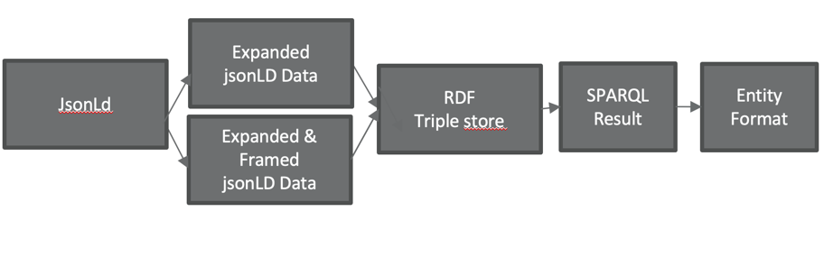

# Application that converts data from jsonld to Entity.

Input data id in jsonLd format -> framing it if needed then expanding it. \
Next it app is pushing it to RDF triple store and executing sparql query on the RDF triple store. \
Sparql result is mapped to Entity Java object format.

JSON Linked Data (jsonLD) is a standard which extends existing json files by giving it a context (and frame). \
The context describes how the data within the json is to be interpreted. \
The frame can optionally change the hierarchy of the jsonLD and add additional default elements. \
This is done, by flattening the jsonLD and rebuilding it. \
A jsonLD file can be converted easily to the rdf triple store, which can then be queried using SPARQL.

Further info related to jsonLd format can be found in official documentation: https://json-ld.org/learn.html.


> #### Important notes:
> - can be used with only JsonLd format
> - For jsonLd processing was used Titanium library: https://github.com/filip26/titanium-json-ld

<a name="build-project"></a>
### Build project

```
gradle build
```

------------------------